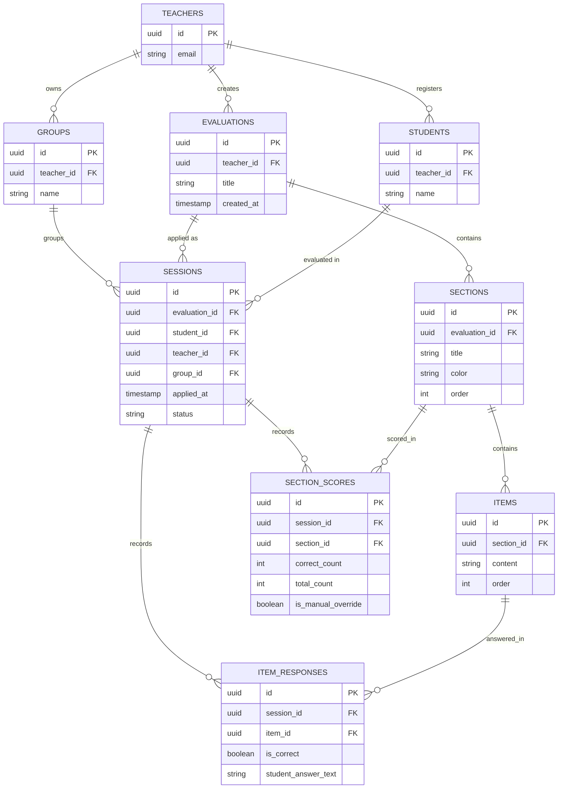

# Oral Evaluation System — Elementary School

## Project context

A system for **elementary school teachers** to conduct oral evaluations/interviews with their students and record correct/incorrect per question, used mainly on a **tablet** during the evaluation.

This is not a written exam the child takes alone: the teacher reads the question out loud, listens to the child's answer, and marks the result in the system.

## Language note

**All UI text, labels, and copy in the application must be in Spanish** (the end users are Spanish-speaking teachers). This document, code comments, variable names, and technical documentation are in English — only the user-facing strings (buttons, labels, headings, messages) should be in Spanish.

## Stack

- **Next.js** (App Router)
- **shadcn/ui**
- **Tailwind CSS**
- **Supabase** (Postgres + Auth + RLS)
- Deployed on **Vercel**

## UI/UX principles

- Primary use on **tablet**, in real time in front of the child.
- **Large buttons and large, legible text** — the teacher needs to mark answers quickly without touch-precision errors.
- When applying an evaluation, **all sections and questions are shown at once** (single screen, scrollable if needed) — no step-by-step wizard, no one-question-at-a-time flow.
- **Automatic saving** on every marked answer as the teacher goes, plus an explicit **"Finish" button** at the end so the teacher has clear certainty the session was saved and is complete.

## Roles and authentication

- A single user type: **teacher**, authenticated via Supabase Auth.
- **Strict multi-tenancy**: each teacher only sees and edits her own evaluations, students, and sessions. This is implemented with **Row Level Security (RLS)** on every table, filtering by `teacher_id = auth.uid()` (directly or inherited via join).

## Domain concepts

### Evaluation (`evaluations`)
A template created by a teacher, used over a period (roughly a trimester/quarter) with all her students. Each trimester the teacher creates a **brand new evaluation from scratch** — sections and questions are **never reused or cloned** across evaluations; they are unique per evaluation.

One evaluation is applied to several groups (e.g. "3° A" and "3° B"). The evaluation has no group of its own.

### Group (`groups`)
A class group of the teacher (e.g. "3° A"). The teacher picks the group when she applies an evaluation to a child, and the group is saved on the session. A new group is created on the fly from that same picker; there is no separate group management screen. The picker preselects the group of the last session (of that student, or of the teacher). A student belongs to every group where they have a session, so the history keeps the group the child had at that time.

### Section / Topic (`sections`)
Each evaluation is divided into sections (e.g. "Numbers", "Adjectives", "Reading Comprehension"). Each section has:
- A free-text **title**.
- A **color**, chosen by the teacher from **10 fixed options** (closed palette, not a free color picker).
- A **score** expressed as a fraction (e.g. "2 out of 5", "4 out of 10"), **auto-calculated** by counting correct/incorrect answers among its items, but the teacher can **manually override** it if needed.
- Free-text notes (e.g. the story text for "reading comprehension") live **at the section level**, not at the question level.

### Question / Item (`items`)
Belongs to a section. It is **free text** (a word, number, sentence, or question) with no special types or format validation — the teacher writes whatever she wants. Items are shown in the order the teacher entered them.

### Student (`students`)
There is no pre-loaded student roster. The student list is generated **on the fly**: the first time the teacher types a new name while applying an evaluation, that name is saved as a student under that teacher. In later evaluations, the name field acts as an **autocomplete** against that list (to avoid duplicates from spelling variations), while still allowing new names to be entered freely.

### Application session (`sessions`)
The event of applying a specific evaluation to a specific student. It can be left **incomplete** (the teacher pauses and resumes later) — the record lives and updates in real time from the moment the first answer is saved, autosaving every mark. The teacher explicitly marks the session as complete by tapping a **"Finish" button**, which sets `status = completed` and gives her clear confirmation that everything was saved. A session not yet finished stays `in_progress`, even if every question happens to have an answer.

### Item response (`item_responses`)
For each answered question within a session, the system stores:
- `is_correct` (required): correct / incorrect.
- `student_answer_text` (optional): the teacher may transcribe what the child said, but it is not required — she can grade with correct/incorrect only, without entering any text.

### Section score within a session (`section_scores`)
For each section, within a session, the system stores the correct/total count (auto-calculated from `item_responses`), with the option for the teacher to manually override it (`is_manual_override`).

## Main flows

### 1. Create an evaluation
1. Teacher creates a new evaluation (title only; groups are picked when applying).
2. Adds sections: title + color (from the 10 options).
3. Within each section, adds questions/items as free text, one at a time, in whatever order she wants.
4. If the teacher edits an evaluation that **already has applied sessions**, the system must show a **warning** (not a block) stating that sessions already exist and that the changes will not alter already-saved answers, but may create inconsistency between older and newer sessions.

### 2. Apply an evaluation to a child
1. Teacher selects an active evaluation.
2. Picks the group, then types or selects (autocomplete) the student's name → this creates or reuses a record in `students` and creates a `session` with that group.
3. The **entire evaluation is shown at a glance**: all sections with all their questions, with large correct/incorrect controls per question and an optional text field for the child's answer.
4. Every mark is **saved automatically** as the teacher goes.
5. Each section's score recalculates itself; the teacher can tap it to manually override it.
6. The teacher can leave at any time and resume later — the session stays `in_progress` until she taps the **"Finish" button**, which marks the session `completed` and confirms to her that it was fully saved.

### 3. Reports by group ("Reportes" section)
- Lists the teacher's groups. Opening a group lists its students.
- Opening a student shows the history of evaluations applied to that child, with the group of each session.
- A button to start a **new evaluation** (session) for that same child.

### 4. Teacher reports (per trimester)
Reports are always scoped to **a single evaluation/trimester at a time** (no cross-trimester comparison), and can be filtered by group. Includes:
- **Totals**: number of students evaluated, completed vs. in-progress sessions.
- **By student view**: list of students in that evaluation with their overall result; drilling in shows the detail by section and question (same as the individual summary).
- **By section view**: list of sections in that evaluation; drilling into one shows a table of all students with their score for that specific section (to spot whether a whole topic was hard for several students).
- **Export**: reports must be exportable (exact format to be decided during implementation — candidates: PDF and/or Excel).

## Data model

Entity-relationship diagram (Mermaid `erDiagram` — Claude Code can parse this block directly):

### Notes on the data model

- `TEACHERS` corresponds to Supabase's `auth.users` (not necessarily its own table, or a minimal mirror table if additional profile fields are needed).
- `SESSIONS.status` distinguishes `in_progress` / `completed`. It is an explicit column, not inferred: it only becomes `completed` when the teacher taps the "Finish" button, regardless of whether every item has an answer.
- `SESSIONS.group_id` is nullable, and reports show a session without a group as "Sin grupo". The groups migration assigned every session that existed before it to a "3B" group of its teacher. `evaluations.group_label` is legacy: the app no longer reads it, and a later migration drops it.
- `SECTIONS.color` stores one of **10 fixed options** (enum or lookup table — to be decided during implementation).
- Every table that depends on a teacher (`evaluations`, `students`, and by inheritance `sections`, `items`, `sessions`, `item_responses`, `section_scores`) must have RLS policies checking `teacher_id = auth.uid()`, either directly or via join to the corresponding parent table.
- There is no reuse of `sections`/`items` across evaluations — each evaluation is independent and self-contained.
- There is no comparison across evaluations/trimesters in reports — each evaluation is reported in isolation.

## Out of scope (explicitly ruled out during planning)

- No pre-loaded student roster — students are generated only from actual use in sessions.
- No images/media in questions.
- No special question types (multiple choice, drag-and-drop, etc.) — every item is free text graded as correct/incorrect.
- No progress comparison across trimesters.
- No blocking of evaluation edits when sessions already exist, only a warning.
